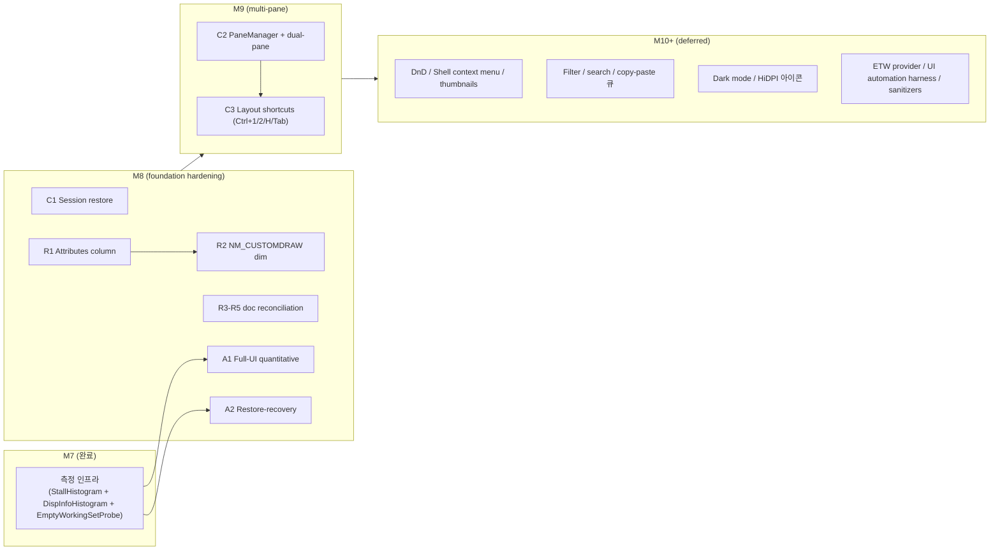

# M8+ Follow-up Roadmap

> **출처**: gap-detector 분석 (commit `fdbd240` 시점) + design §17 Deferred + handoff carry-forward
> **현재 HEAD**: `8e4f1ef` (M1–M7 closed, match rate 95%)
> **작성일**: 2026-05-17
> **연결 문서**: `docs/usage-guide.md` §6, `docs/05-report/features/fast-explorer-core.report.md` §M8 Roadmap

본 문서는 M1–M7 PDCA 사이클 종료 시점에 carry-forward 처리한 모든 작업을 의존성과 우선순위에 따라 M8 / M9 / M10+ 마일스톤으로 분류합니다. 각 항목은 atom 단위로 쪼개기 가능한 최소 작업 단위까지 구체화되어 있어 `/pdca plan` 단계 입력으로 바로 사용 가능합니다.

---

## 1. 한 페이지 요약

| 마일스톤 | 테마 | 핵심 산출 | 예상 atom 수 | 예상 기간 |
|----------|------|-----------|------------|-----------|
| **M8** | Foundation hardening + manual measurement | C1 + R1 + R2 + R3-R5 doc + A1 + A2 | 6-8 | 3-5일 |
| **M9** | Multi-pane block | C2 + C3 | 10-15 | 5-7일 |
| **M10+** | Deferred (design §17 origin) | DnD, thumbnails, filter, dark mode, ETW 등 | TBD | TBD |

권장 진입 순서: **M8 → M9 → M10+**. M8은 contained / low-risk로 M1-M7 약속을 마무리하고, M9는 architectural shift이므로 깨끗한 baseline에서 시작해야 합니다.

---

## 2. 의존성 그래프

> **참고**: `r1 --> r2`는 strict dependency가 아니라 권장 순서입니다. R2 (dimming)가 R1 (Attributes column)이 노출하는 H/S 마커와 같은 데이터 소스를 사용하므로 묶어서 작업하는 것이 자연스럽습니다.

---

## 3. M8 — Foundation Hardening + Manual Measurement

목표: M1-M7 design promise를 마무리하고, full-UI 정량 측정 게이트를 닫는다. 모든 atom이 독립적이라 병렬 진행 가능.

### 3.1 C1 Session restore

| 항목 | 내용 |
|------|------|
| **출처** | Plan §4.3 "Included" but never built; design §2.1.2 lock |
| **저장 경로** | `%LOCALAPPDATA%\FastExplorer\settings.json` |
| **저장 항목** | last path, window position/size, layout state (M9에서 multi-pane 추가 시 확장) |
| **신규 코드** | `src/core/settings-store.{h,cpp}` (~150 LOC) + `tests/settings-store-tests.cpp` |
| **라이프사이클** | `AppServices` 초기화 시 load, `MainWindow::onCreate` 적용, `WM_NCDESTROY` 직전 save |
| **장애 모델** | 파일 없음 / parse 실패 / write 실패 모두 silent fallback (기본값 사용 + 로그) |
| **예상 atom** | 1개 (reader + writer + 통합 + tests 한번에) |
| **예상 LOC** | +200 |
| **예상 시간** | 2-3시간 |

설계 결정 포인트 (Plan 단계에서 확정 필요):
- JSON 형식 (현재 코드베이스에 JSON writer 있음 — `bench-json.cpp` 재사용 가능?) vs flat key=value 형식
- atomic write 전략 (temp file + rename)
- migration story (필드 추가/삭제 시 forward/backward compatibility)

### 3.2 R1 Attributes column

| 항목 | 내용 |
|------|------|
| **출처** | Design §4.4 Table — H/S/R/J/L/C 마커 |
| **데이터 소스** | `FileEntry.flags` (`kIsReparse`, `kIsCloudPlaceholder` 이미 존재; H/S/R은 Win32 attributes로부터 채우기) |
| **변경 파일** | `src/ui/main-window.cpp` (`kColumns` 확장), `src/ui/column-formatter.{h,cpp}` (Attributes formatter), `src/core/win32-fs-backend.cpp` (H/S/R flags 추가) |
| **예상 atom** | 1개 |
| **예상 LOC** | +80 + 1 test file (~50 LOC) |
| **예상 시간** | 1.5-2시간 |

설계 결정 포인트:
- 컬럼 폭 default (기본 폰트에서 6문자 분량 ≈ 50 px)
- DPI 스케일링은 기존 `scaleForDpi` 패턴 재사용
- 마커 우선순위 (H + S 동시일 때 표시 순서)

### 3.3 R2 NM_CUSTOMDRAW dimming

| 항목 | 내용 |
|------|------|
| **출처** | Design §4.4.2 — 숨김/시스템 파일 `COLOR_GRAYTEXT` 디밍 |
| **변경 파일** | `src/ui/main-window.cpp` `handleCustomDraw()` (현재 `CDDS_ITEMPREPAINT`에서 `CDRF_DODEFAULT` 반환) |
| **추가 처리** | `CDDS_ITEMPREPAINT`에서 row → flags 조회 → 숨김/시스템이면 `clrText = GetSysColor(COLOR_GRAYTEXT)` 설정 + `CDRF_NEWFONT` 반환 |
| **예상 atom** | 1개 |
| **예상 LOC** | +40 + 1 test file (~30 LOC, headless로는 dispatch만 검증 가능) |
| **예상 시간** | 1시간 |
| **의존** | R1 권장 (같은 flags 데이터 경로) |

성능 주의: NM_CUSTOMDRAW는 매 row 표시마다 호출되므로 lookup이 O(1)이어야 함. `pane.store().visibleAt(row)` 호출만으로 충분.

### 3.4 R3-R5 PerfTracker doc reconciliation

| 항목 | 내용 |
|------|------|
| **출처** | gap-detector: design §11.1이 14 events 약속하지만 ship된 enum은 6개 |
| **권장 방향** | M7 측정 인프라 (StallHistogram + DispInfoHistogram + EmptyWorkingSetProbe + MemoryProbe)가 §11.1의 sort/op/enum-complete/stall 이벤트를 histogram 기반 surface로 대체했음을 design에 명문화 |
| **변경 파일** | `docs/02-design/features/fast-explorer-core.design.md` §11.1 + version bump to v1.0.11 |
| **대안** | 실제로 누락된 event 5-7개 구현 (각 ~5 LOC: enum 추가 + record 호출). PerfTracker 호출 site는 이미 코드 곳곳에 존재하므로 코딩 코스트는 낮음 |
| **예상 atom** | 1개 (doc) 또는 2-3개 (구현 + test) |
| **예상 시간** | doc 30분 / 구현 2-3시간 |

권장: **doc 방향**. histogram-based 측정이 더 정확하고 (count + percentile), point-event는 개별 호출 추적 용도로만 의미가 있음. design 의도를 측정 인프라에 맞게 갱신하는 것이 정직.

### 3.5 A1 Full-UI Stall + GETDISPINFO p99 quantitative

| 항목 | 내용 |
|------|------|
| **출처** | M7 §14.7 amber, runbook `docs/02-design/runbooks/m7-1hour-soak-checklist.md` |
| **유형** | 매뉴얼 (코드 변경 없음) |
| **준비물** | `FastExplorer.exe` Release 빌드 + LargeFlat (100k) + MixedNames + DeepTree 데이터셋 (`FastExplorerBench.exe generate` 미리 생성) |
| **실행** | 60분 interactive 세션: 폴더 진입/나가기 ×50, 정렬 토글 ×20, 1k 행 선택 후 스크롤, 새 폴더/이름변경/삭제 ×10, 최소화/복원 ×5 |
| **수집** | 셧다운 시 `[stall-histogram]` + `[dispinfo-histogram]` + `EmptyWorkingSet:` 로그 캡처 |
| **검증 게이트** | StallHistogram ≥500ms bucket = 0 / DispInfoHistogram p99 ≤ 50 µs |
| **결과 반영** | `docs/02-design/features/fast-explorer-core.design.md` §14.7 deliverable 표 amber → 측정값 + ✅ |
| **예상 시간** | 1시간 (실행) + 30분 (결과 반영) |

### 3.6 A2 EmptyWorkingSet restore-recovery quantitative

| 항목 | 내용 |
|------|------|
| **출처** | M7 §14.7 amber |
| **현재 상태** | `EmptyWorkingSetProbe`가 call latency + before/after bytes 측정 완료. 부족한 것은 **복원 후 working set 회복 시간** 측정 (restore from minimize trigger → 첫 정상 렌더링까지의 working set 곡선) |
| **유형** | 매뉴얼 (또는 UI automation harness 도입 시 자동화) |
| **실행** | 최소화 → 5분 대기 → 복원 → 200 ms 시점에 `EmptyWorkingSet:` 로그 + GetProcessMemoryInfo 캡처 (PerfMon 또는 매뉴얼 측정) |
| **게이트** | 복원 후 working set ≤ 200 ms 내 정상화 |
| **자동화 옵션** | UI Automation Client COM (`IUIAutomation` + `IUIAutomationCondition`)으로 최소화/복원 시뮬레이션. M10+ "UI automation harness" 항목으로 분리 가능 |
| **예상 시간** | 매뉴얼 1시간 / UI automation 도입 시 +1일 |

---

## 4. M9 — Multi-pane Block

목표: dual-horizontal pane 아키텍처 도입. design §4.2의 multi-pane 약속과 §14.7의 multi-pane soak gate를 닫는다.

### 4.1 C2 PaneManager + dual-horizontal layout

이번 마일스톤의 핵심. M1-M7 single-pane 가정에 깊이 박혀 있는 코드 다수를 손봐야 함.

#### 변경 범위

| 영역 | 변경 |
|------|------|
| **신규 클래스** | `src/ui/pane-manager.{h,cpp}` — `std::vector<std::unique_ptr<PaneController>>` 보유, 활성 pane index 추적 |
| **`MainWindow`** | `std::unique_ptr<PaneController> pane_` → `PaneManager paneManager_`. 모든 `pane_->...` 호출 → `paneManager_.active()->...` |
| **레이아웃** | `onSize`에서 dual 모드일 때 listView 영역을 2 분할 (현재는 단일 listView 전제). Splitter window 또는 두 개의 listView 인스턴스 |
| **메시지 디스패치** | `WM_FE_ENUM_*` / `kWmFeIconBatch` / `kWmFeOperationResult` / `kWmFeFsChange` 등 모든 user message에 pane index 인코딩 (현재 `WPARAM`은 generation만 사용; pane index를 HIWORD에 packing하거나 LPARAM 활용) |
| **상태바** | active pane 정보만 표시 vs 두 pane 정보 동시 표시 (Plan 단계 결정) |
| **선택 / 라벨편집** | `SelectionSync` / `LabelEditController`를 pane당 1개씩 만들지, 활성 pane에 따라 redirect할지 결정 |
| **FsWatcher** | pane당 1개 watcher (현재 PaneController에 이미 1개씩 — naturally scales) |
| **session restore (C1 확장)** | layout 모드 (single/dual) + 각 pane의 last path 저장 |

#### 예상 atom 분할

1. **PaneManager skeleton** (LOC ~120 + test) — 단일 pane만 owner하는 dummy로 시작, 기존 동작 보존
2. **레이아웃 분할** (LOC ~80) — `onSize`에서 split 처리, listView 2개 생성
3. **메시지 dispatch 확장** (LOC ~60) — pane index encoding/decoding
4. **선택/라벨편집 분리** (LOC ~50) — pane당 인스턴스
5. **활성 pane 전환** (LOC ~30) — focus 변경 + 활성 표시
6. **회귀 정리** (LOC ~50) — 단일 pane 모드 fallback 검증, 기존 testcase 전수 통과

#### 게이트 (M9 entry criteria)

- 모든 M1-M7 테스트 통과 (single pane 회귀 없음)
- Dual-pane soak: 양쪽 pane에서 50회 폴더 전환 누적 working set Δ ≤ 10 MB (design §14.7)
- 활성 pane 전환 latency ≤ 16 ms (1 frame)

**예상 LOC**: +500 (코어 + tests)
**예상 시간**: 3-5일

### 4.2 C3 Layout shortcuts (Ctrl+1 / Ctrl+2 / Ctrl+H / Tab)

C2 완료 후 추가. 모두 PaneManager API 호출만으로 처리.

| 단축키 | 동작 |
|--------|------|
| `Ctrl+1` | 단일 pane 모드로 전환 (활성 pane만 남김) |
| `Ctrl+2` | dual-horizontal pane 모드로 전환 (2번째 pane 추가 또는 표시) |
| `Ctrl+H` | dual ↔ single 토글 (Ctrl+1/2 짝꿍) |
| `Tab` | 활성 pane 전환 (left ↔ right) |

**예상 atom**: 1개 (4 단축키 + accelerator 테이블 확장 + handler dispatch + tests)
**예상 LOC**: +60 + 1 test file
**예상 시간**: 2시간

---

## 5. M10+ — Deferred (design §17 origin)

design §17의 deferred 항목 중 **사용 빈도 + 임팩트**가 높은 것 우선. 각 항목은 별도 마일스톤 또는 묶음 처리 가능.

### 5.1 사용자 가시 기능

| 항목 | design §17 | 우선순위 근거 |
|------|------------|---------------|
| **Filter / search-as-you-type** | §17.1 | 100k 파일 대용량 폴더에서 검색 없이는 사실상 사용 불가능. 우선순위 높음 |
| **Drag and drop (OLE)** | §17.1 | 표준 Windows UX 기대치. R1/R2 후 자연스러운 다음 단계 |
| **Shell context menu** | §17.1 | 마우스 우클릭 메뉴 부재. DnD와 묶어 처리 권장 |
| **Thumbnails (`IThumbnailProvider`)** | §17.1 | 이미지/문서 폴더 사용성. M1-M7 아이콘 인프라 확장 |
| **Copy / cut / paste 큐** | §17.1 | 현재 M6은 단일 명령만. ShellWorker 큐 확장 |
| **Folder recursive size** | §17.1 | 컬럼 추가 + 백그라운드 walker. Win32 native에서 expected feature |
| **Archive browsing (zip-as-folder)** | §17.1 | shell IShellFolder 통합 필요. 큰 작업 |

### 5.2 플랫폼 / 시스템

| 항목 | design §17 | 우선순위 근거 |
|------|------------|---------------|
| **Dark mode** | §17.2 | Windows 11 default. 우선순위 높음 (사용자 가시) |
| **HiDPI 아이콘 (`IShellItemImageFactory`)** | §17.2 | 4K 모니터에서 32×32 아이콘은 흐림 |
| **Accessibility UIA provider** | §17.2 | 접근성 인증 필요 시 |

### 5.3 Observability / Build

| 항목 | design §17 | 우선순위 근거 |
|------|------------|---------------|
| **UI automation harness** | §17.3 | A2 restore-recovery 자동화 + 회귀 테스트 자동화에 직접 도움 |
| **ETW custom provider** | §17.3 (M7 stretch) | PerfView 통합으로 profile 분석 향상 |
| **AddressSanitizer / UBSan** | §17.3 | MSVC ASan 지원으로 도입 비용 낮아짐. 회귀 방어 향상 |
| **MSIX packaging** | §17.3 | 배포 단계 진입 시 필요 |
| **Static analyzer CI** | §17.3 | PVS-Studio 또는 Clang-Tidy CI 통합 |

### 5.4 영구 보류 권장

- **Direct2D/DirectWrite custom file list**: LVS_OWNERDATA가 충분히 빠름. 검증된 인프라 교체 비용이 이득 대비 큼
- **Quad layout**: dual-horizontal로도 1080p에서 한 pane 당 약 540×740 px로 가독성 한계. quad는 4K+ 모니터 전용이 됨
- **Plugin system**: scope creep 위험 매우 큼. 핵심 기능 안정화 후 재검토
- **Windows Explorer replacement registration**: 시스템 안정성 리스크. 별도 제품 라인이 필요한 결정

---

## 6. 우선순위 결정 근거

### M8 우선 (foundation hardening)
- 모든 항목이 작고 (atom 1개씩) 독립적 → 병렬 진행 가능
- M1-M7 design promise를 정직하게 마무리 (95% → 98%+ match rate)
- M9 multi-pane 진입 전에 baseline이 깨끗해야 회귀 추적이 명확
- A1/A2는 측정만 남은 상태이므로 빠른 closure 가능

### M9 우선 (multi-pane block)
- design §4.2의 핵심 약속이고, 차별화 포인트의 절반 (다른 절반은 성능)
- C2를 미루면 M10+ deferred 항목들도 single-pane 가정으로 설계됨 → 나중에 더 큰 rework
- C1 session restore가 M8에서 단일 pane용으로 만들어진 후 M9에서 dual로 확장 (점진적)

### M10+ 그룹화 권장
- **사용자 임팩트 그룹**: Filter / DnD / Shell context menu / thumbnails — 한 마일스톤에 묶기 (UX 만족도 도약)
- **개발자 임팩트 그룹**: UI automation + ETW + sanitizers — 한 마일스톤에 묶기 (회귀 방어 + 디버깅)
- **플랫폼 그룹**: Dark mode + HiDPI — 한 마일스톤에 묶기 (Windows 11 native feel)

---

## 7. M8 진입을 위한 다음 액션

순서대로 실행:

1. **`/pdca plan fast-explorer-core-m8`** 또는 기존 plan v1.0.3을 v1.0.4로 bump하여 M8 섹션 추가
2. **Plan 단계 결정 필요 항목**:
   - C1 settings.json 형식 (JSON 재사용 vs 새 flat)
   - R3-R5 방향 (doc reconciliation vs 일부 event 구현)
   - A1/A2 매뉴얼 실행 일정 (개발자 가용성)
3. **Design 단계 산출**: M8.1 ~ M8.6 atom별 세부 설계 (대부분 변경 작음)
4. **Do 단계 atom 진행 순서 권장**:
   - 1단계 (병렬): R3-R5 doc reconciliation + A1/A2 매뉴얼 측정 (코드 변경 0)
   - 2단계 (병렬): R1 Attributes column + R2 NM_CUSTOMDRAW dim (같은 flags 데이터 소스, atom 분리는 review 부담 측면에서만 의미)
   - 3단계: C1 Session restore (독립적이라 언제든 가능)
5. **Check 단계 게이트**: 481개+ 테스트 (M7의 431 + R1/R2/C1 atom당 ~10-15 신규), match rate ≥ 95%

---

## 8. M9 진입을 위한 사전 조건

1. M8 Check 완료 (95%+ match rate)
2. C2 atom 분할 시뮬레이션: 6개 atom 각각 L1+L2 review 가능한 크기인지 사전 검증
3. dual-pane soak gate 측정 환경 준비 (M7 인프라 재사용)
4. 회귀 테스트 baseline 캡처 (single-pane 모드 fallback이 모든 M1-M8 테스트 통과해야 함)

---

## 9. 참조

| 출처 | 위치 |
|------|------|
| gap-detector 분석 | 이번 세션 (commit `fdbd240` 시점, match rate 93→95%) |
| Design carry-forward 명시 | `docs/02-design/features/fast-explorer-core.design.md` §14.7 + §17 |
| Plan 미구현 약속 | `docs/01-plan/features/fast-explorer-core.plan.md` §4.3 |
| Runbook | `docs/02-design/runbooks/m7-1hour-soak-checklist.md` |
| Report | `docs/05-report/features/fast-explorer-core.report.md` |
| 사용 가이드 | `docs/usage-guide.md` §6 |

---

**문서 작성**: 2026-05-17 (HEAD `8e4f1ef`)
**다음 갱신**: M8 Plan 단계 진입 시 (Plan 결정 사항 반영)
