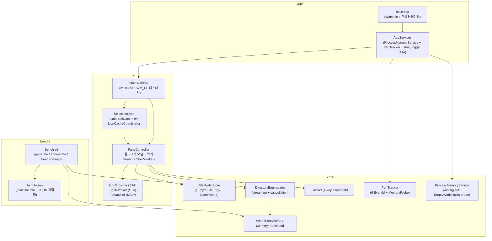

# Fast Explorer 사용 가이드

> **버전**: M1–M7 마일스톤 블록 (HEAD `5ee2573`, 2026-05-17)
> **대상**: End-user + Developer 통합 종합 가이드
> **소요 시간**: End-user 5분 / Developer 15분

본 문서는 (1) 일반 사용자를 위한 실행 및 단축키 사용법, (2) 개발자를 위한 빌드/테스트/벤치마크 절차, (3) 아키텍처 개요를 통합 정리합니다.

---

## 1. 개요

Fast Explorer는 Windows 11 네이티브 C++20 파일 탐색기 MVP입니다. 핵심 정체성은 "응답성 우선" — 대용량 폴더 진입 시 UI 멈춤 없이 첫 배치를 즉시 표시하고, 100k 파일을 9.39 MB working set으로 처리합니다.

| 항목 | 내용 |
|------|------|
| Target Platform | Windows 11 x64 |
| 빌드 | MSVC v143 (Visual Studio 2026 Community 가정), C++20, Windows SDK 10.0.22621.0 |
| 의존성 | comctl32, shell32, ole32, oleaut32, user32, gdi32, uxtheme, dbghelp, propsys, psapi |
| 외부 라이브러리 | 없음 (vendored 의존성 0개) |

핵심 성능 지표 (M7 측정):

| 지표 | 측정값 | 목표 | 마진 |
|------|--------|------|------|
| 100k 파일 working set (headless) | **9.39 MB** | ≤ 50 MB | 5.3× |
| 10-cycle 메모리 drift | **404 KB** | ≤ 5 MB | 12.4× |
| Large (100k) 첫 배치 표시 | **29.83 ms** | ≤ 200 ms | 6.7× |
| Medium (10k) 정렬 (Name asc) | **2.75 ms** | ≤ 50 ms | 18.2× |

---

## 2. End-User 가이드

### 2.1 실행

빌드 산출물은 `build\FastExplorer.exe`에 위치합니다. 더블클릭 또는 명령줄에서 실행하세요:

```powershell
& build\FastExplorer.exe
```

별도 설치 절차나 레지스트리 등록은 필요하지 않습니다 (portable). 첫 실행 시 현재 작업 디렉터리 또는 빈 화면으로 시작하며, 주소창에 경로를 입력해 탐색을 시작합니다.

### 2.2 키보드 단축키

| 단축키 | 동작 | 비고 |
|--------|------|------|
| `Ctrl + L` | 주소창 포커스 + 전체 선택 | URL 입력처럼 즉시 새 경로 입력 가능 |
| `Alt + ←` | 뒤로 가기 | 히스토리 back 스택 |
| `Alt + →` | 앞으로 가기 | 히스토리 forward 스택 |
| `Alt + ↑` | 상위 폴더로 이동 | 드라이브 루트에서는 no-op |
| `F5` | 새로고침 | 현재 폴더 재열거 (히스토리 보존) |
| `F2` | 이름 바꾸기 | 리스트 뷰 포커스 시에만 활성화 |
| `Delete` | 휴지통으로 이동 | 리스트 뷰 포커스 시에만 활성화 |
| `Ctrl + Shift + N` | 새 폴더 | "New folder" → 충돌 시 "New folder (2)" 자동 증가, 생성 후 즉시 in-place 편집 |
| `Enter` (주소창) | 입력 경로로 이동 | 주소창 전용 |

> **참고**: `Ctrl+1` / `Ctrl+2` / `Ctrl+H` / `Tab` (멀티 패널 전환)은 M8+ carry-forward입니다. 현재 빌드는 단일 패널 전용입니다.

### 2.3 주요 기능

#### 폴더 탐색
주소창에 절대 경로 입력 또는 더블클릭으로 하위 폴더 진입. 파일 더블클릭은 `ShellExecuteExW("open")` 동작으로 OS 기본 핸들러를 호출합니다. UNC 경로 (`\\server\share`)와 상대 경로는 거부됩니다 (현재 카탈로그 제한).

#### 정렬
컬럼 헤더 클릭으로 `Name / Size / Type / Modified` 4가지 키 기준 오름차순/내림차순 토글 정렬. 2,000 행을 초과하는 폴더는 백그라운드 worker에서 정렬하며, 정렬 중에도 UI는 응답합니다. 정렬 후에도 선택은 raw index 기준으로 보존되어 같은 파일이 새 위치에서 유지됩니다.

#### 파일 작업
삭제 (휴지통), 이름 바꾸기, 새 폴더 만들기는 STA worker 스레드의 `IFileOperation`을 통해 수행됩니다. 모든 작업 결과는 상태바에 마지막 결과 1건만 표시됩니다 (연속 작업 시 깜박임 방지). 파일시스템 watcher가 변경을 감지해 100 ms 디바운스 후 자동 새로고침합니다.

#### 메모리 자동 관리
창이 최소화되면 일정 시간 후 자동으로 아이콘 캐시를 비우고 `EmptyWorkingSet`을 호출해 working set을 회복합니다. 복원 시 placeholder 아이콘으로 시작해 백그라운드에서 다시 채워집니다.

### 2.4 디버그 로그
실행 중 `[stall-histogram]`, `[dispinfo-histogram]`, `EmptyWorkingSet:` 접두 로그가 셧다운 시점 stdout으로 덤프됩니다. 콘솔에서 실행하면 직접 확인할 수 있고, 일반 더블클릭 실행에서는 출력이 보이지 않습니다 (WIN32 subsystem).

---

## 3. Developer 가이드

### 3.1 빌드 prerequisites

| 요구사항 | 버전 / 경로 |
|----------|-------------|
| Visual Studio | 2026 Community 이상 (Build Tools만으로도 가능) |
| MSVC | v143 toolset |
| Windows SDK | 10.0.22621.0 (강제 — 다른 SDK는 거부) |
| CMake | 3.24 이상 |
| Git | 임의 최신 버전 |

### 3.2 빌드 절차

PowerShell에서 매 세션 첫 호출 시 VsDevCmd로 환경 진입:

```powershell
cmd /c '"C:\Program Files\Microsoft Visual Studio\18\Community\Common7\Tools\VsDevCmd.bat" -arch=x64 -host_arch=x64 -winsdk=10.0.22621.0 -no_logo && cmake -B build -S . && cmake --build build --config Release'
```

산출물:
- `build\FastExplorer.exe` — UI 실행 파일
- `build\FastExplorerBench.exe` — 벤치마크 CLI
- `build\core-tests.exe` — 단위/통합 테스트 러너

빌드 옵션은 모두 `CMakeLists.txt`에 고정되어 있으며, `/W4 /permissive- /Zc:__cplusplus /utf-8`, `_WIN32_WINNT=0x0A00`, `MultiThreadedDLL` CRT를 사용합니다.

### 3.3 테스트 실행

```powershell
& build\core-tests.exe
```

기대 결과:

```
431 passed, 0 failed (of 431)
```

테스트는 `tests/test-harness.h`의 minimal harness 기반이며 외부 의존성이 없습니다 (Catch2/GoogleTest 미사용). 모든 테스트는 anonymous-namespace 헬퍼 + `TempDir` RAII 패턴으로 격리됩니다.

테스트 영역별 분포:

| 영역 | 파일 | 케이스 수 |
|------|------|-----------|
| Path / FS / Enumeration | `path-utils-tests.cpp`, `directory-enumerator-tests.cpp`, `win32-fs-backend-tests.cpp`, `memory-fs-backend-tests.cpp`, `fs-backend-tests.cpp` | ~80 |
| Model store / Name arena | `file-model-store-tests.cpp`, `name-arena-tests.cpp`, `file-entry-tests.cpp` | ~69 |
| Sort / Selection | `file-sort-tests.cpp`, `pane-controller-tests.cpp`, `pane-sort-coordinator-tests.cpp`, `selection-sync-tests.cpp` | ~85 |
| UI 코디네이터 / 포맷 | `label-edit-controller-tests.cpp`, `icon-cache-tests.cpp`, `icon-provider-tests.cpp`, `extension-icon-cache-tests.cpp`, `format-cache-tests.cpp`, `column-formatter-tests.cpp`, `folder-name-tests.cpp`, `dispinfo-histogram-tests.cpp` | ~75 |
| Bench / 측정 | `dataset-generator-tests.cpp`, `enumeration-bench-tests.cpp`, `head-to-head-bench-tests.cpp`, `bench-cli-tests.cpp`, `bench-json-tests.cpp`, `perf-tracker-tests.cpp`, `process-memory-tests.cpp`, `stall-probe-tests.cpp` | ~80 |
| 기타 | `ui-messages-tests.cpp`, `dpi-scale-tests.cpp`, `status-text-tests.cpp`, `shell-worker-tests.cpp`, `result-channel-tests.cpp` | ~42 |

### 3.4 벤치마크 CLI

`FastExplorerBench.exe`는 데이터셋 생성 + 측정을 담당합니다.

#### 데이터셋 생성

```powershell
& build\FastExplorerBench.exe generate --preset large-flat --out $env:TEMP\fe-100k
```

지원 preset:

| Preset | 구조 | 비고 |
|--------|------|------|
| `small` | 200 entries 평탄 | 빠른 smoke test |
| `medium` | 10,000 entries 평탄 | 정렬/스크롤 검증 |
| `large-flat` | 100,000 entries 평탄 | 핵심 성능 게이트 |
| `mixed-names` | 짧은/긴/유니코드 이름 혼합 | 이름 비교 경로 |
| `mixed-types` | 파일/폴더/심볼릭 혼합 | flags 처리 검증 |
| `many-dirs` | 폴더 위주 | 디렉터리 메타데이터 |
| `deep-tree` | 깊은 중첩 | 재귀 enumeration |

#### 단일 enumeration 측정

```powershell
& build\FastExplorerBench.exe enumerate --path $env:TEMP\fe-100k --runs 10
```

- `--runs 1..10000` (기본 5): 통계 신뢰성 향상을 위해 여러 회 실행 후 median/p95 보고
- `--format text|json` (기본 text): JSON 형식은 CI 회귀 비교용 (machine info 포함)

JSON 결과 캡처:

```powershell
cmd /c "build\FastExplorerBench.exe enumerate --path $env:TEMP\fe-100k --runs 10 --format json > baseline.json"
```

> **주의**: `>` 리다이렉트는 `cmd /c`로 감싸야 합니다. PowerShell의 `>`는 UTF-16 BOM을 추가해 `_O_U8TEXT` 환경에서 손상됩니다.

#### Head-to-head 비교

`FindFirstFileExW` vs `GetFileInformationByHandleEx` 원시 Win32 API 비교 측정:

```powershell
& build\FastExplorerBench.exe head-to-head --path $env:TEMP\fe-100k --runs 5
```

### 3.5 baseline 회귀 비교

`scripts\bench-compare.ps1`는 두 JSON 스냅샷의 5% 허용 범위 비교 + §14.7 drift gate를 검증합니다. CI에서 사용 권장:

```powershell
pwsh -File scripts\bench-compare.ps1 -Baseline baseline.json -Current current.json -TolerancePercent 5
```

종료 코드:
- `0` — 회귀 없음
- `1` — 허용 범위 초과 (regression)
- `2` — 게이트 위반 (drift / working set 초과)

### 3.6 1-hour soak protocol

`docs/02-design/runbooks/m7-1hour-soak-checklist.md`에 60분 interactive 검증 절차가 정리되어 있습니다. 핵심 gate:

- Crash 0 — unhandled exception / SEH fault 0
- Memory leak 0 — working-set drift ≤ 5 MB
- Stall ceiling — 최대 dispatch latency ≤ 500 ms (`StallHistogram` "≥500ms" bucket 0)
- GETDISPINFO p99 ≤ 50 µs

준비: `large-flat` + `mixed-names` 데이터셋 사전 생성, Defender/indexer/cloud sync 상태 기록, idle baseline working set 캡처.

---

## 4. 아키텍처 개요

### 4.1 레이어 구조



### 4.2 주요 클래스 및 SRP 경계

| 클래스 | 책임 |
|--------|------|
| `MainWindow` | wndProc + 메시지 디스패치 표 + 코디네이터 소유 (785 LOC, M7 SRP 후) |
| `PaneController` | 폴더 1개의 모델 + enumeration worker + history 스택 + 선택 (raw index) + ShellWorker 큐 |
| `PaneSortCoordinator` | 정렬 상태 + 동기/백그라운드 정렬 정책 (워커 활성 중에는 거부) |
| `IconCacheCoordinator` | placeholder ImageList + Extension LRU + IconProvider STA worker (M6 T3 추출) |
| `SelectionSync` | LVN_ITEMCHANGED ↔ PaneController 양방향 동기화 + reentrancy 가드 (M6 follow-up 추출) |
| `LabelEditController` | LVS_EDITLABELS lifecycle + F2/Ctrl+Shift+N + create-then-edit 핸드오프 (M6 follow-up 추출) |
| `ShellWorker` | STA 스레드의 `IFileOperation` 큐 (delete/rename/createFolder) + `ResultChannel<T>` |
| `IconProvider` | STA 스레드의 `SHGetFileInfo` 호출 + 결과 채널 |
| `FsWatcher` | `ReadDirectoryChangesW` + IOCP 루프, 100 ms 디바운스 후 refresh 시그널 |
| `FileModelStore` | append-only `std::vector<FileEntry>` + atomic publishedCount + visibleOrder 인덱스 |
| `NameArena` | `VirtualAlloc` 기반 string 슬랩 (이름 평균 32 B, 100k 파일 ≈ 1 MB) |
| `ProcessMemoryService` | `GetProcessMemoryInfo` + `EmptyWorkingSet` probe + 최소화 콜백 |
| `PerfTracker` | 이벤트 로그 + MemoryProbe 헬퍼 (6 EventId) |
| `RingLogger` | lock-free 링 버퍼 로거 (셧다운 시 dump) |
| `StallHistogram` | 7 버킷 메시지 dispatch latency 측정 |
| `DispInfoHistogram` | LVN_GETDISPINFO 호출당 latency 측정 (50 µs 게이트 버킷 경계) |

### 4.3 측정 인프라

M7에서 9개 atom으로 구축한 측정 시스템:

| 컴포넌트 | 목적 |
|----------|------|
| `PerfTracker::MemoryProbe` | 5개 sample site (launch / pane-open / first-batch / enum-complete / shutdown) |
| `EnumerationBench::WorkingSetSamples` | 100k 데이터셋 enumeration 중 peak working set 추적 |
| Memory soak (10-cycle drift) | 동일 폴더 반복 열기로 누적 leak 검출 (404 KB drift = no-leak signature) |
| `StallHistogram` | 7 버킷 dispatch latency aggregator, shutdown dump |
| `DispInfoHistogram` | LVN_GETDISPINFO p99 estimator, 50 µs 경계 버킷 |
| `EmptyWorkingSetProbe` | call latency + before/after bytes envelope |
| `bench-json` | machine info (GetSystemInfo + RtlGetVersion) 포함 JSON 직렬화 |
| `bench-compare.ps1` | 두 JSON 비교 + 5% tolerance + drift gate |
| 1-hour soak checklist | 매뉴얼 protocol (`runbooks/m7-1hour-soak-checklist.md`) |

### 4.4 Win32 / 동시성 핵심 패턴

- **`LVS_OWNERDATA` + `LVS_EDITLABELS`**: 가상 리스트뷰가 모델 데이터를 직접 들고 있지 않음. `LVN_GETDISPINFO`로 매 셀 요청. `LVN_ENDLABELEDIT`는 항상 FALSE 반환 (모델 갱신은 컨트롤러 책임).
- **3-layer cancellation**: (L1) generation ID stale 체크로 PostMessage 결과 폐기 / (L2) `std::stop_token`으로 batch 경계에서 worker 종료 / (L3) IFileOperation은 sync (취소 불가, drop on stop).
- **STA worker 격리**: IconProvider + ShellWorker는 자체 STA 스레드에서 COM 호출. UI 스레드와 ResultChannel\<T\>로 통신.
- **Lost-result race fix**: `ResultChannel<T>::drainResults`의 `postPending_.store(false)`는 swap mutex **안쪽**에 위치해야 함 (M6 atom 6d 학습).
- **`CompareStringOrdinal IgnoreCase`**: NTFS case-folding과 일치하는 ordinal 비교. `std::towlower`는 locale-dependent이므로 비-ASCII에서 NTFS와 불일치.
- **`_O_U8TEXT` stdout**: `_setmode(_fileno(stdout), _O_U8TEXT)` 환경에서 좁은 `fwrite`는 MSVC `/GS` overrun 트리거. `MultiByteToWideChar` → `fputws` round trip으로 회피.

---

## 5. M1–M7 성과 요약

자세한 회고는 `docs/05-report/features/fast-explorer-core.report.md`를 참조.

| 마일스톤 | 핵심 산출 |
|----------|-----------|
| M1 Native Scaffold | 앱 골격, 매니페스트, crash handler, RingLogger, ProcessMemoryService, DPI v2 |
| M2 Core Enumeration | path-utils, FsBackend 추상화, FileEntry 40 B 고정, NameArena, PerfTracker, bench CLI |
| M3 Virtual List UI | `LVS_OWNERDATA` + cache-hint + DPI 스케일 + status bar + stall probe + format LRU |
| M4 Navigation + FsWatch | 주소바, 히스토리, 2-layer generation, IOCP watcher, 100 ms 디바운스 타이머 |
| M5 Sorting + Selection | 4-key 정렬, visibleOrder 인덱스, raw-index 안정 선택, 2k 행 백그라운드 정렬 임계값 |
| M6 Icons + Basic Ops | ImageList + Extension LRU + IconProvider STA + ShellWorker IFileOperation + VK_DELETE/F2/Ctrl+Shift+N + low-memory shrink |
| M7 Bench + Stabilization | MemoryProbe, 100k 측정, 10-cycle soak, StallHistogram, DispInfoHistogram, bench JSON, EmptyWorkingSet probe, bench-compare CI script |

- 누적 커밋: ~80개
- 누적 테스트: 0 → 431
- 설계 일치율: 95% (gap-detector 측정, R6 closure 후)

---

## 6. M8+ Carry-forward

다음 마일스톤 블록에서 처리할 항목:

| 항목 | 출처 |
|------|------|
| **C1 Session restore** | Plan §4.3 — `%LOCALAPPDATA%\FastExplorer\settings.json` (last path / layout / window size). M4 자연스러운 home이었으나 미구현 |
| **C2 Multi-pane** | Design §4.2 — dual-horizontal pane 아키텍처 |
| **C3 Layout shortcuts** | Design §4.5 — `Ctrl+1` / `Ctrl+2` / `Ctrl+H` / `Tab` (C2 의존) |
| **R1 Attributes column** | Design §4.4 — H/S/R/J/L/C 마커 (FileEntry.flags에서 추출) |
| **R2 NM_CUSTOMDRAW dimming** | Design §4.4.2 — 숨김/시스템 파일 `COLOR_GRAYTEXT` 디밍 |
| **R3-R5 PerfTracker §11.1 events** | 14개 약속 중 6개 ship; histogram 기반 측정 인프라가 대체했으므로 doc 조정 권장 |
| **A1 Full-UI Stall + p99 정량** | M7 amber — 1-hour interactive soak 매뉴얼 실행 |
| **A2 Restore-recovery 정량** | M7 amber — UI automation harness 필요 |

---

## 7. 참조 문서

| 문서 | 위치 |
|------|------|
| Plan | `docs/01-plan/features/fast-explorer-core.plan.md` v1.0.3 |
| Design | `docs/02-design/features/fast-explorer-core.design.md` v1.0.10 |
| Report | `docs/05-report/features/fast-explorer-core.report.md` v1.0.0 |
| 1-hour soak | `docs/02-design/runbooks/m7-1hour-soak-checklist.md` |
| 최신 핸드오프 | `docs/handoffs/2026-05-17_m6-close-m7-prep-measurement.md` |
| baseline 비교 스크립트 | `scripts/bench-compare.ps1` |
| 테스트 하네스 | `tests/test-harness.h` + `tests/bench-fs-helper.h` |

---

## 8. 트러블슈팅

| 증상 | 원인 / 해결 |
|------|-------------|
| 빌드 시 `'vswhere.exe' not recognized` | VsDevCmd가 부분 초기화 실패. `cmd /c "...VsDevCmd.bat... && cmake..."` 형식으로 wrapping 필요 (PowerShell 인자 파싱 충돌) |
| 테스트 첫 실행 transient 실패 | Defender 또는 antivirus가 TempDir 스캔. 2-3회 연속 실행으로 안정성 확인. `shellWorkerForTest().waitForProcessedForTest(1)`는 디스크 가시성 보장됨 (`fetch_add(1)`이 `performShellRename` 이후 실행) |
| `_O_U8TEXT` 환경에서 좁은 fwrite로 프로세스 즉시 종료 | MSVC `/GS` stack overrun으로 보고됨. 실제는 `_O_U8TEXT` + 좁은 fwrite UB. JSON 출력은 `MultiByteToWideChar` → `fputws` 사용 |
| 100k 폴더 첫 진입이 200 ms 초과 | Defender 실시간 검사 의심. `--preset large-flat` 데이터셋을 제외 폴더에 배치 후 재측정 |
| 정렬 후 선택이 다른 행에 표시 | `SelectionSync::reapplyFromPane()`이 호출되지 않음. `finalizeSortApply()` 경로 확인 |
| 새 폴더 생성 후 즉시 편집이 시작되지 않음 | `LabelEditController::maybeStartPendingEdit()`이 `onEnumComplete`에서 호출되지 않음. `pendingFolderNameForTest()` 값 확인 후 `listView_ == nullptr` 게이트 디버그 |

---

## 9. 라이선스 및 기여

- 라이선스: 미정 (private 저장소 단계)
- Repository: `https://github.com/solitasroh/fast-explorer.git`
- 기여 워크플로: PDCA 사이클 (`/pdca` 슬래시 커맨드 또는 직접 plan → design → do → check → report 단계 진행). 자세한 사항은 `CLAUDE.md` 및 `.rkit/state/`의 PDCA 메타데이터 참조.

---

**문서 작성**: 2026-05-17 (HEAD `5ee2573`)
**다음 갱신 예정**: M8 마일스톤 블록 종료 시점
